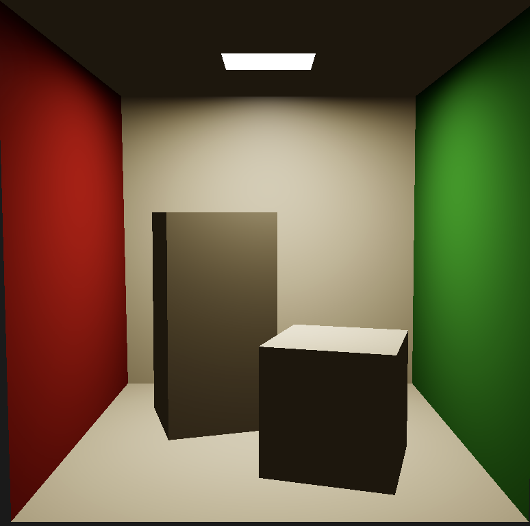
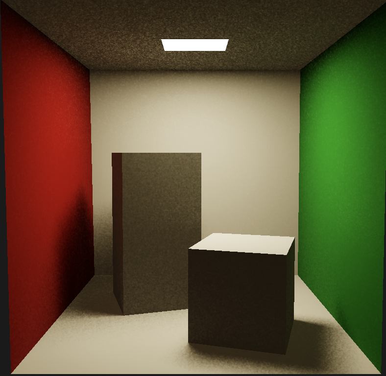

# MetalCppHybridRendering
## Testing Hybrid Rendering using Metal API ##
### USC CSCI-580: 3D Graphics and Rendering Final Project ###

> This is a proof-of-concept implementation for the Hybrid Rendering using Metal API.
#### Screenshots ####
- Stage 1: Rasterization

- Stage 2: Ray Tracing

- Stage 3: Blending & Denoising using MetalFX

> Should expect around 60FPS using Apple M4 chip

#### 1. Goal of this project ####
- Our goal is to mix rasterization and ray tracing for a better performance and quality.
- This part is to use Metal API to implement hybrid rendering, to use Metal's acceleration architecture and high efficiency.

#### 2. Project Structure ####
- This project is divided into 2 separate build targets: CMake for a traditional windowed app for macOS and XCode project for macOS and iOS.
- The CMake app cannot adjust parameters. By default, it renders at `2560x1440`, with Ray Tracing and MetalFX denoiser enabled.
- The XCode project, reused from Apple's sample code, can adjust parameters like render mode, exposure, and denoiser switch. By default, it renders at `1600x1200`, with Ray Tracing and MetalFX denoiser enabled.

#### 3. Build and Testing ####
> Since Metal is an Apple-only API, an Apple Silicon-based Mac is required to run this project.
- XCode developer tools and Metal development pack are required to build this project, but CMake should build the project fine.
- To build the CMake target, simply use CMakeList.txt to build the project.
- To build the XCode target, open the XCode project, select the target, and build to run. It may prompt you to sign. Follow the instructions provided by Apple to run locally on Mac.
- The iOS build target will require an Apple Developer account to build and run.

#### 4. Real-time Rendering Parameters for XCode Project ####
- **Rendering Mode**: You can select among Rasterize (RT Off), Hybrid (RT On), and Ray Tracing (RT Only).
- **Exposure**: You can adjust the exposure of the rendered image.
- **Denoiser**: You can enable or disable the MetalFX denoiser.

#### 5. References for work used ####
- AI-assisted Code:
  - Codex is used to merge Apple's sample code with `Mtl_Engine`. Detailed lines are marked in the code.
- Reused Code:
  - Apple's sample code [`Rendering reflections in real time using ray tracing`](https://developer.apple.com/documentation/Metal/rendering-reflections-in-real-time-using-ray-tracing) is used as the View controller for this project. It does not participate in actual rendering.
  - `Metal.hpp` is the Single-header Metal API wrapper, generated by Apple-provided script as easier import for `metal-cpp`.
  - `MetalFX` folder is also a part provided by `metal-cpp`, but was not included in single-header import `Metal.hpp`. It is still a part of `metal-cpp`.
- Documents:
  - [Metal Overview](https://developer.apple.com/metal/)
  - [Metal 4 API](https://developer.apple.com/metal/whats-new/)
  - [Metal Progression](https://lowendmac.com/2025/metal-4-an-overview/)
  - [metal-cpp](https://developer.apple.com/metal/cpp/)
- Previous Project:
  - [Metal Ray Tracing with Monte Carlo](https://github.com/codetiger/MetalRayTracing)
- Samples and models:
  - [Cornell Box](https://github.com/vaffeine/vulkano-raytracing/blob/master/assets/cornell-box.obj )
  - [Explore hybrid rendering with Metal ray tracing](https://developer.apple.com/videos/play/wwdc2021/10150/)
  - [AAPL Implementation Set: Rendering reflections in real time using ray tracing](https://developer.apple.com/documentation/Metal/rendering-reflections-in-real-time-using-ray-tracing)